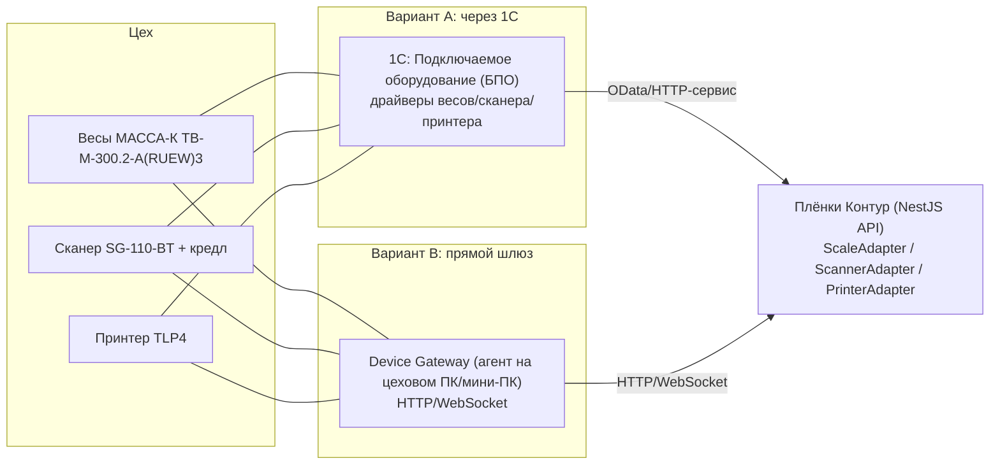

# Плёнки Контур — руководство по подключению весов, сканера и принтера

> Фактически проверенный профиль первого Ubuntu-поста зафиксирован в
> [полевой базе знаний](./qa/2026-07-21-physical-devices-field-knowledge.md): RS-232→USB
> `4800/even` для МАССА-К, USB/CUPS raw ZPL для TLP4 и HID keyboard для SG-110-BT. Для этого
> комплекта он заменяет ранние предположения ниже про Ethernet/TSPL2.

Дата: 2026-07-15
Назначение: как правильно подключить цеховое оборудование к платформе, чтобы всё чётко
работало. Для устройств принят Variant B: Gateway Agent на каждом Ubuntu-посту; 1С остаётся
отдельным источником финансовых и учётных данных.

Оборудование клиента:

- **Весы МАССА-К ТВ-М-300.2-A(RUEW)3**, платформа 600×800, НПВ ~300 кг.
  Подтверждённый transport: **RS-232 → PL2303 USB adapter**.
- **Принтер термотрансферный TLP4**. Интерфейсы: **Ethernet, RS-232, USB, WiFi**.
- **Сканер ШК SG-110-BT**, беспроводной, **адаптер 2.4G**, кредл (база).

> Для весов физически подтверждён официальный бинарный МАССА-К Protocol 100, терминальный режим
> `100`, `4800 baud`, even parity и stable `/dev/serial/by-id/...`. Native USB профиль
> `57600/none` остаётся альтернативой для совместимой ревизии, но не был рабочим transport этого
> первого комплекта.

---

## 1. Три архитектуры подключения



**Вариант A — всё через 1С.**
Устройства подключаются к 1С через подсистему **«Подключаемое оборудование» (БПО)**: 1С
держит драйверы весов/сканера/принтера, а наша платформа берёт данные/шлёт команды из 1С
(OData/HTTP-сервис).

- ➕ Единая точка, бухгалтерия и так в 1С, драйверы готовы (весы «1С-совместимы»).
- ➖ Для **онлайн-взвешивания** и скана в реальном времени — лишняя задержка и зависимость:
  1С-обмен обычно документо-/batch-ориентирован, не «миллисекундный» цех.

**Вариант B — прямой локальный шлюз (Device Gateway).**
Небольшой агент на цеховом ПК/мини-ПК (или промышленном мини-сервере) общается с устройствами
напрямую (RS-232/USB/Ethernet/WiFi) и отдаёт нашей платформе по HTTP/WebSocket. Это и есть
**реальная реализация наших адаптеров** вместо mock.

- ➕ Реалтайм, низкая задержка, **работает при недоступной 1С** (offline-устойчивость цеха).
- ➖ Ещё один компонент, который надо развернуть и обслуживать.

**Разделение контуров (принято).**

- **Онлайн-взвешивание + скан + печать этикеток → Вариант B (шлюз).** Это «горячий» цеховой
  путь: оператор/склад не должны зависеть от 1С в момент взвешивания/скана.
- **Бухгалтерия (счета, оплаты, контрагенты, отгрузки) → Вариант A (1С).** Финансовая правда
  остаётся в 1С, мы тянем source-snapshots.
- Печать этикеток можно вести и через 1С, и через шлюз — на выбор; для скорости лучше шлюз.

---

## 2. Как это ложится на код платформы

В платформе уже есть **адаптерный слой** (mock-first, ТЗ §11.8) — реальные драйверы
подменяют mock без правки бизнес-логики:

```
apps/api/src/integrations/
  scale/    ScaleAdapter   (DI-токен SCALE_ADAPTER)    — сейчас MockScaleAdapter
  scanner/  ScannerAdapter (DI-токен SCANNER_ADAPTER)  — сейчас MockScannerAdapter
  printer/  PrinterAdapter (DI-токен PRINTER_ADAPTER)  — сейчас MockPrinterAdapter
  onec/     OneCAdapter    (DI-токен ONEC_ADAPTER)      — сейчас MockOneCAdapter
  integrations.module.ts   ← здесь меняется useClass: Mock… → реальный адаптер
```

Контракты, которые нужно реализовать реальным адаптером:

```ts
interface ScaleAdapter {
  read(deviceId, kind: 'spool' | 'roll'): Promise<ScaleReading>;
} // {status, stable, grossKg}
interface ScannerAdapter {
  parse(payload: string): { rollCode: string | null; valid: boolean };
}
interface PrinterAdapter {
  print(printerId, { rollCode, qrCode }): Promise<PrintJobResult>;
} // {status:'submitted'|'printed'|'failed'|'delivery_unknown'}
interface OneCAdapter {
  pullInvoice(orderRef): Promise<OneCInvoiceSnapshot>;
} // и далее: оплаты/контрагенты/отгрузки
```

Принцип замены: реальный адаптер в варианте B вызывает **Device Gateway** (HTTP), а в
варианте A — **1С** (OData/HTTP-сервис). Бизнес-правила (запрет ручного веса при онлайн-весах,
аудит перепечатки, scan-first) уже зашиты выше адаптера.

---

## МАССА-К ТВ-М-300.2-A(RUEW)3 — первый physical profile

- Подключение: RS-232 терминала A(RUEW) → PL2303 USB adapter → Ubuntu.
- Ubuntu path: только стабильный symlink `/dev/serial/by-id/...`, не `/dev/ttyUSB0`/`ttyACM0`.
- Mode: `SCALE_MODE=massa-k-protocol-100`.
- Protocol: v3, `F8 55 CE`, `CMD_GET_MASSA 0x23`, CRC-16-CCITT по body.
- Рабочая линия: `SCALE_SERIAL_BAUD=4800`, `SCALE_SERIAL_PARITY=even`, меню `rS-232 → 100`.
- Для человека/движущегося тестового груза используется `FILtr=dYn`; для рулона — `FILtr=StAt`.
- `status=ready` возможен только после корректного CRC и `Stable=1`.
- Проверка: `npm run build -w @plenka/gateway-agent`, затем
  `npm run --silent probe:scale -w @plenka/gateway-agent`.
- `probe.simulated` обязан быть `false`; raw frame, scale ID и production token не публикуются в
  операторских инструкциях или скриншотах.

**Правила платформы:** если reading имеет `status != ready` или `stable != true`, операция
блокируется, а ручной ввод веса запрещён. Исключение big-bag допускается только с аудитом.

`serial` — только legacy generic ASCII test adapter. Он никогда не является режимом физического
evidence для этих весов. CLI использует строгие коды завершения:

- `0` — только авторитетный физический Protocol 100 result: `ready`, `stable`, корректные identity,
  CRC и цена деления;
- `2` — simulated, offline, unstable или любой другой неавторитетный результат;
- `1` — ошибка конфигурации, probe или cleanup.

### Физический S1 gate на Ubuntu — PENDING

Шаги ниже выполняются только на TG-TPC-150A5 с подключёнными весами МАССА-К. В этой рабочей
среде стенд не подключён, поэтому identity, zero/load, moving-load и unplug проверки не запускались.
До выполнения всех команд статус физического gate остаётся **PENDING**. Это инженерный bench до
S3 `.deb`; финальная установка поста не использует `git clone` или `npm install`.

#### 1. Найти ровно одно USB serial устройство

Оставить подключённым только serial-интерфейс весов и выполнить:

```bash
mapfile -t scale_ports < <(find /dev/serial/by-id -maxdepth 1 -type l -print | sort)
printf '%s\n' "${scale_ports[@]}"
test "${#scale_ports[@]}" -eq 1
export SCALE_SERIAL_PORT="${scale_ports[0]}"
udevadm info --query=property --name="$SCALE_SERIAL_PORT" | rg '^(ID_VENDOR|ID_MODEL|ID_SERIAL)='
```

Разрешён только `/dev/serial/by-id/...`. При нуле или нескольких кандидатах отключить лишние
устройства и повторить; выбирать порт по порядку `/dev/ttyUSBN` или `/dev/ttyACMN` запрещено.

#### 2. Проверить identity и стабильный нулевой груз

```bash
export SCALE_MODE=massa-k-protocol-100
export SCALE_SERIAL_BAUD=4800
export SCALE_SERIAL_PARITY=even
export SCALE_READ_TIMEOUT_MS=1500
set -o pipefail
npm run build -w @plenka/gateway-agent
npm run --silent probe:scale -w @plenka/gateway-agent | tee /tmp/massa-k-zero.json
test "${PIPESTATUS[0]}" -eq 0
jq -e '
  .probe.ok == true and
  .probe.simulated == false and
  .probe.protocol == "massa-k-protocol-100" and
  (.probe.identity.scaleId | type == "number") and
  .reading.status == "ready" and
  .reading.stable == true and
  .reading.grossKg >= 0 and
  (.reading.divisionKg | IN(0.0001, 0.001, 0.01, 0.1, 1))
' /tmp/massa-k-zero.json
```

Оба кода завершения должны быть `0`. JSON не должен содержать `raw`, token, stack или serial path;
успех также подтверждает physical little-endian request/CRC profile терминала.

#### 3. Сверить известный стабильный груз с табло

Положить известный груз, дождаться индикатора стабильности и выполнить:

```bash
npm run --silent probe:scale -w @plenka/gateway-agent | tee /tmp/massa-k-load.json
test "${PIPESTATUS[0]}" -eq 0
read -r -p 'Enter the kg value shown on the scale display: ' DISPLAY_KG
jq -e --argjson display "$DISPLAY_KG" '
  .reading.status == "ready" and
  .reading.stable == true and
  ((.reading.grossKg - $display) | if . < 0 then -. else . end) <= .reading.divisionKg
' /tmp/massa-k-load.json
```

Расхождение нормализованного веса с табло допускается не более одной текущей цены деления.

#### 4. Проверить moving load и unplug

Непрерывно двигать груз, пока выполняется запрос массы:

```bash
npm run --silent probe:scale -w @plenka/gateway-agent | tee /tmp/massa-k-moving.json
test "${PIPESTATUS[0]}" -eq 2
jq -e '.probe.simulated == false and .reading.status == "unstable" and .reading.stable == false' /tmp/massa-k-moving.json
```

Затем отключить USB-кабель и выполнить:

```bash
npm run --silent probe:scale -w @plenka/gateway-agent | tee /tmp/massa-k-unplugged.json
test "${PIPESTATUS[0]}" -eq 2
jq -e '.probe.ok == false and .probe.status == "offline" and .reading == null' /tmp/massa-k-unplugged.json
```

#### 5. Сохранить и удалить evidence

Во внешний контролируемый test record записываются commit SHA, Node/Ubuntu versions, модель из
передаточного документа, protocol, имя identity, division/timings, сверка display/normalized и
исходы stable/moving/unplug. Даже безопасный `scaleId` из JSON редактируется **до** того, как
evidence покидает контролируемый локальный output.

В Git запрещены raw frame, serial/scale ID, токены, коммерческие изображения и документы.
Необработанный вывод `udevadm` и временные JSON также не коммитятся. После прикрепления
редактированной проекции к внешнему test record удалить локальные файлы:

```bash
rm -f /tmp/massa-k-*.json
```

---

## 4. Сканер ШК SG-110-BT (scan-first склад)

**Назначение:** скан QR/штрих-кода рулона на приёмке/выдаче → `POST /warehouse/tasks/:id/scans`.

Беспроводной 2.4G + кредл — кредл (база) подключается к ПК. **Два режима** (выбрать в настройках
сканера, обычно сканированием спец-кода из мануала):

### 4A. Режим HID-клавиатуры (keyboard wedge) — самый простой, рекомендуется

- Кредл = USB-HID: скан «печатает» код в активное поле + Enter.
- На складском экране есть **фокусное поле скана**; платформа ловит ввод и шлёт
  `POST /warehouse/tasks/:id/scans { payload }`.
- ➕ Ноль драйверов, работает сразу, идеально под scan-first.
- ➖ Нужно держать фокус на поле скана (UX уже на это рассчитан).

### 4B. Режим виртуального COM (serial) — для шлюза

- Кредл = виртуальный COM-порт; Device Gateway читает строки сканов и шлёт в платформу.
- ➕ Не зависит от фокуса поля, можно вести журнал сканов на шлюзе.
- Проверка: backend сопоставляет точные байты непрозрачного `prt_<64 hex>` с рулоном и
  отбраковывает чужой/изменённый payload. UI не получает ожидаемый токен и не автоподставляет его.

### Через 1С (Вариант A)

- 1С тоже умеет сканер через БПО (как «Сканер штрихкода»), но для нашего scan-first склада
  HID-режим (4A) проще и быстрее. 1С-режим оставить для складских операций, которые ведутся
  прямо в 1С.

**Правила платформы (уже реализованы):** статусы скана `expected/scanned/accepted/missing/
excess/duplicate/wrong/damaged`; дубликаты и чужие коды видны явно; закрытие приёмки —
подтверждением (полное/частичное), не автоматически.

---

## 5. Принтер TLP4 (печать QR-этикеток)

**Назначение:** печать этикетки с QR рулона на шаге `qr-print`; перепечатка — с причиной+аудитом.

**Подтверждённый интерфейс первого поста:** USB → официальный HT600/TLP4 CUPS driver → queue
`TLP4` → raw ZPL. Ethernet RAW остаётся допустимой альтернативой, но для нового transport нужен
отдельный physical gate.

### 5A. Прямой шлюз / платформа (Вариант B)

1. Принтер → USB Ubuntu-поста; `lsusb` и `lpinfo -v` должны видеть MERTECH.
2. Установить официальный Linux driver HT600/TLP4 203 dpi и создать единственную queue `TLP4`.
3. Перевести принтер в ZPL и отправлять только raw ZPL. Пример:
   ```
   ^XA
   ^PW464^LL320
   ^FO24,24^BQN,2,6^FDLA,TEST-ROLL-1^FS
   ^FO24,240^A0N,28,28^FDTEST-ROLL-1^FS
   ^PQ1
   ^XZ
   ```
4. Отправить макет через `lp -d TLP4 -o raw label.zpl`. Реальный `PrinterAdapter.print()` делает
   это через `cups-zpl` и
   возвращает `{status:'submitted'|'failed'|'delivery_unknown', failureReason}`. Принятие задания
   CUPS означает только `submitted`, никогда не `printed`; неоднозначный исход не ретраится
   автоматически.
   Физическое подтверждение даёт точный HID-скан реально вышедшей этикетки, а визуальный S4 gate
   остаётся **PENDING** до теста на MERTECH TLP4.
5. Платформа: при `failed` (например `offline-printer`) шаг этикетки **блокируется**; перепечатка
   требует **причину** и пишет `audit:label_reprint_requested`.
   При `delivery_unknown` оператор не может повторять печать. Admin с `admin:devices` фиксирует
   фактический исход через `POST /api/admin/label-print-jobs/:id/reconcile`: `label_observed`
   допускает только последующий точный HID-скан, `not_printed` разблокирует reasoned reprint.
   Reconciliation имеет UUID idempotency key, post/line locks, append-only audit и не раскрывает
   содержимое QR либо raw transport evidence.

### 5B. Через 1С (Вариант A)

- Печать этикетки можно вести макетом 1С (СКД/макет) через БПО «Принтер этикеток».
- ➖ Сложнее синхронизировать QR-контент с нашим рулоном; для скорости лучше 5A.

**Согласовать:** размер этикетки, содержимое (QR-данные = непрозрачный `prt_<64 hex>`, доп. текст),
DPI/скорость/затемнение, тип риббона/материала.

---

## 6. Подключение платформы к 1С (для финансов и, опционально, устройств)

Рекомендуемый способ — **OData (REST) опубликованной базы 1С** (самый универсальный):

1. В 1С опубликовать **стандартный интерфейс OData** (Конфигуратор → Публикация на веб-сервере)
   и выдать пользователю права на нужные объекты.
2. Реальный `OneCAdapter`:
   - `GET /odata/standard.odata/Document_СчетНаОплату?...` — счета;
   - оплаты/контрагенты/отгрузки — соответствующие документы/регистры;
   - писать обратно (если разрешено) — `POST` документов (уточнить: можно ли создавать в 1С
     извне или только читать — ТЗ §12.2).
3. Каждый ответ 1С сохраняем как **SourceSnapshot**: `parsed` (бизнес-интерпретация, видна
   финансам) + `rawPayload` (только Админу, ТЗ §8) + `staleness`.
4. `SyncJournal` ведёт статус/ретраи/ручной разбор; `source-retry` перетягивает снимок.

Альтернативы OData (если не подходит): **HTTP-сервисы 1С** (свой REST на 1С), **web-сервисы
(SOAP)**, **файловый обмен EnterpriseData (XML)**. Выбор — discovery с вашим IT.

---

## 7. Сеть, безопасность, отказоустойчивость

- **Отдельный VLAN/подсеть для цеховых устройств**, статические IP, фиксированные порты.
- Device Gateway и платформа — по HTTPS/токену; устройства не «смотрят» в интернет.
- **Offline-устойчивость:** при недоступной 1С цех продолжает взвешивать/сканировать/печатать
  через шлюз; финансовые снимки догоняются позже (snapshot + staleness уже это поддерживают).
- **Журналирование:** все спорные действия (перепечатка, ручной ввес big-bag, отклонение веса,
  кассовые операции) уже пишутся в append-only audit на стороне платформы.
- WiFi допустим для сети поста, но проводной LAN предпочтительнее; весы остаются локально на USB.

---

## 8. Чек-лист внедрения

- [x] Архитектура: устройства — Variant B (локальный Gateway Agent), бухгалтерия — 1С.
- [x] Весы: physical Protocol 100 через RS-232→USB, `4800/even` на первом посту.
- [x] Сканер: SG-110-BT 2.4G HID + Enter, operator и warehouse physical scan.
- [x] Принтер: USB/CUPS queue `TLP4`, ZPL, физическая roll label и pallet label.
- [x] Развернуть Device Gateway для Variant B на первом Ubuntu-посту.
- [x] Реальные gateway adapters включены для пилотного поста.
- [ ] Прописать ID устройств в конфиге платформы (env): какие весы/принтеры на каких рабочих местах.
- [ ] 1С: опубликовать OData/HTTP-сервис, выдать права, отдать URL+креды, дать **тестовую базу**.
- [ ] Сквозной тест: взвешивание → допуск → QR-печать → скан на складе → отгрузка → снимок оплаты из 1С.

## 9. Что обязательно уточнить (discovery)

1. **Весы:** на каждом новом экземпляре повторно зафиксировать by-id и проверить
   `4800/even` RS-232 либо допустимый native USB профиль `57600/none`; не переносить identity.
2. **Принтер TLP4:** ZPL подтверждён; на каждом экземпляре повторно проверить PPD, media,
   ribbon, darkness и размеры `58×40`/`100×150`.
3. **Сканер:** HID + Enter подтверждён; на каждой ревизии проверить pairing и отсутствие duplicate.
4. **1С:** конфигурация и версия, механизм обмена (OData/HTTP/web/файл), можно ли **писать** в 1С
   извне или только читать, частота обновления оплат, lifecycle кассовых операций.
5. **Нормы:** финальный допуск веса по типам плёнки (сейчас ±5% заглушка), нормы скотча.
6. **Палетный лист:** требуемые поля и формат (Word/Excel/PDF).
7. **Рабочие места:** карта «какое устройство на каком рабочем месте/станке».
